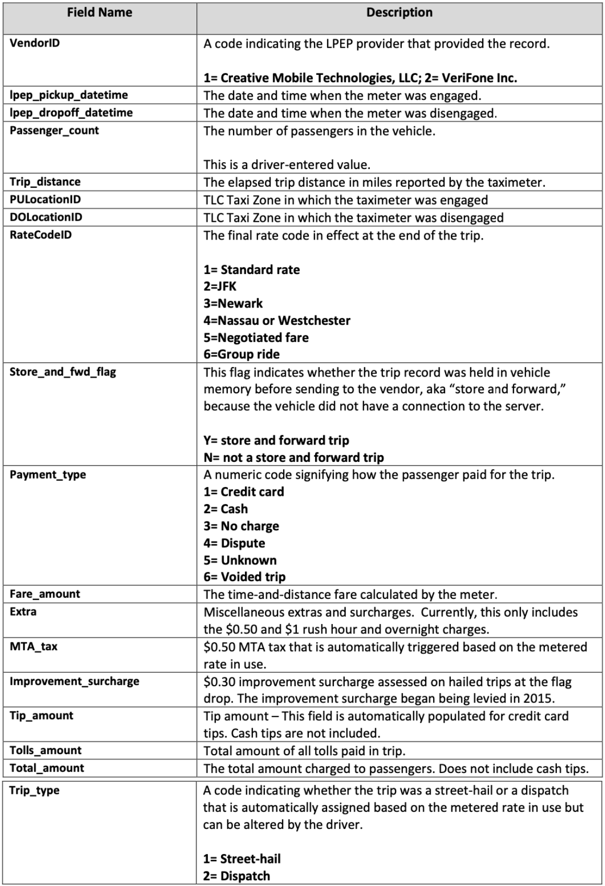

# NYC_Green_Taxi_Data_Analysis 
 The goal of this assignment is to study the relative performance of a set of tools: Pandas, Dask, Vaex and HDF5. Analyzed the data from New York City Taxi and Limousine commission for Green Taxis. Data processing and analyses are completed using Pandas, Dask and Vaex. We will follow the article "How to analyze 100 GB of data on your laptop with Python" which is at https://towardsdatascience.com/how-to-analyse-100s-of-gbs-of- data-on-your-laptop-with-python-f83363dda94. Runtime perfor- mance of each to perform the task is one metric to report. 
 
# Data Dictionary
Please check.
https://www1.nyc.gov/site/tlc/about/tlc-trip-record-data.page

# Conclusion
To begin with Pandas is known to be efficient to mostly be used for computing smaller data sets and comparatively easier to maintain. However, Pandas draws a lot more memory  as data gets bigger, and therefore is susceptible for a MemoryError. Pandas inherently uses only one core so even if we were to choose a faster machine it may not solve the problem, as the other 31 cores will be rendered idle.  

The latest version of Vaex supports all the commonly used string manipulations. To put this in context, string operations using Vaex are up to ~30–100x faster on a 4 core or quad-core laptop, and about 1000 times faster on a 32 core machine. The way Vaex does this is by executing, all string operations in parallel, straight from the core.  Therefore Vaex can evaluate a humongous million line data set with ease.

Dask is an amazing library that allows parallel computations for Python.Dask dataframe is built on top of Pandas, which basically means that it inherits all issues in Pandas such as performance, and memory usage.
General observation was that dask dataframe was actually slower than pure Pandas by an approximate factor of 2. I found dask very complecated for programming as it has very confusing functions like groupby, count, unique etc.  
  
In Summary, Pandas is here to stay as, its flexibility is one of its greatest strengths. However, when data-sets become too large to handle we seek other options like Vaex and Dask. Vaex sees to scale up performance by using more parallel threads. Using lazy evaluation, calculations and operations are done only when needed and performed in groups, and memory is wasted. Expressions that led to your results are stored, which forms the foundation of vaex-ml, a novel approach to doing machine learning Dask dataframe tries to attack large data-sets by building on top of Pandas, but inherits its issues.  

While performing one of the question in dask I found that we cant insert columns in dask dataframe whereas columns can be inserted and deleted from Pandas DataFrame. Pandas has easy DataFrame  management and file format compatibility. 
I only began to explore the vast potential of python through this course. The different ways with which a certain data set can be approached is not only fascinating but extremely liberating, especially when we get the actual numbers on efficiency and conclude on its effective use cases. According to me Vaex is always a good idea when we have to use lot of data. It has data visualization options as well and the number of code lines is less.
